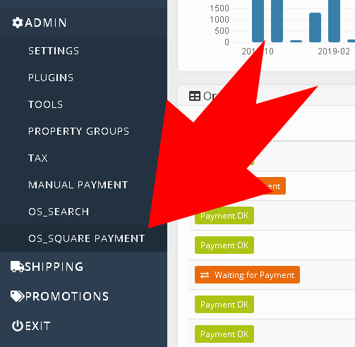
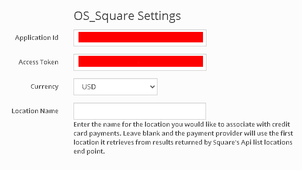

# OS_Square
A DNN OpenStore payment provider plugin

## Getting Started
This is a payment provider plugin for [](https://www.openstore-ecommerce.com/en-gb/OpenStore). It will enable any 
DNN 9.4+ site running OpenStore to accept CC payments into their [Square](https://squareup.com/) account.  You must 
have a valid Square account and a [developers](https://developer.squareup.com/) 
api key for this provider to work.

### About the Install
The current version of DNN depends on Newtonsoft.Json v10.0.3 and Square v6.5 depends on 
Newtonsoft.Json 12+.  You cannot overwrite the version which DNN depends on without errors 
therefore this module install updates the web config with binding redirects to support 
side by side versions of Newtonsoft.

***NOTE: This is NOT a supported, nor-suggested, process to override and could very well 
have major impacts to DNN functionality*** -- [read more](https://github.com/dnnsoftware/Dnn.Platform/discussions/4295)

How's that for a confidence builder?

The good news is that DNN will update it's Newtonsoft dependency soon at which point the 
web config modifications won't be required. 

***If you are using a 3rd party module with a Newtonsoft dependency that is >10.0.3 and <12.0.3 
there exists the potential for a problem***  You should test in a non production environment 
if you have concerns before trying an install on your production server.


Devs should be expecting their web config after an OS_Square install to look as follows:

```
<dependentAssembly xmlns="urn:schemas-microsoft-com:asm.v1">
   <assemblyIdentity name="Newtonsoft.Json" publicKeyToken="30ad4fe6b2a6aeed" />
   <bindingRedirect oldVersion="0.0.0.0-10.0.3.32767" newVersion="10.0.0.0" />
   <bindingRedirect oldVersion="10.0.4.0-32767.32767.32767.32767" newVersion="12.0.0.0" />
   <codeBase version="12.0.0.0" href="bin\NewtonSoft.Json\V12\Newtonsoft.Json.dll" />
   <codeBase version="10.0.0.0" href="bin\Newtonsoft.Json.dll" />
</dependentAssembly>
```

The module installation will also place the Newtonsoft.Json v12.0.3 library into the proper 
directory which will match up with the v12 directory specified in the web config. (NOTE: If you 
prefer you can use the v2.0.5.1 tag to compile a version of this provider that uses the 
deprecated Square.Connect library and does not make web.config changes but it won't see 
future updates either.)


### Installing
1. Backup your db and DNN site.  Install into DNN as a normal module.  The installation process will ensure that your 
DNN OpenStore installation is using at least v8.5.2 of the [NBrightTemplateSys](https://github.com/nbrightproject/NBrightTS). 
v8.5.2 is the first NBrightTemplateSys version to include encryption support for text 
inputs.  It's required for encrypting your Square Application Id and Access Tokin(i502 typo).  


2. Go into Open-Store BO>Admin, the "OS_Square" option should be listed.



3. See Square's [developers](https://developer.squareup.com/) portal for your Application ID & Access Token.


4. Configure your OpenStore Back Office plugin settings for the Square plugin with the credentials from step 3. 



5. Select currency code that is relevant to your Square account.  Presently there is 
support for USD, CAD, AUD, GBP, JPY.

 


6. Optionally enter a Location Name.  The provider by default uses the first location 
returned from your account via the ListLocations endpoint but if you have more than one 
location you can optionally specify it by Name in the Location input.  ***If the name 
you entered does not match a Location Name in your Square account you will receive an 
error***


7. Select the sandbox mode when you are testing against your sandbox account.  Uncheck this 
box when you are ready to send requests to your actual Square account.  ***You must have 
IIS bound to localhost for testing***.  Urls such as dnndev.me or dnn.local won't work.  Your 
production server must be using https.

---

*Congratulations*! The gateway should now be ready and your customers can purchase securely with the Square 
payment form during your OpenStore checkout process.


---

### Development
 1. Backup your db and DNN site.  Install the module into your development enviroment.
 2. Clone the repo to your /DesktopModules/i502Club/ directory.
 2. Your development environment IIS server must bind your DNN site to localhost 
	otherwise the payment form & Square assembly will not work using the sandbox.  
 3. See the [Square](https://developer.squareup.com/) developer portal for your Application ID, Access Token and test cc card information.
 4. Configure your settings for the Square plugin.  You will need an Application ID and API Access Token.
	The provider by default uses the first location returned from your account but if you have more 
	than one location you can optionally specify it by Name in the Location input.
 5. You should be able to compile and attach the debugger at this point.
 6. You can test charges against your sandbox using the [test CC numbers](https://developer.squareup.com/docs/testing/test-values) 


### Dependencies

 * Square v6.5.0.0
 * NewtonSoft v12 
 
 There is no sql provider with this module install but it's best to still *follow best practice and back up both 
 your db & file system before installing*.  

 
It's expected that the DNN 10 update will also include an upgrade to it's Newtonsoft.Json dependency 
and at that point we should be able to simplify the install.


## History
This module is the evolution of an earlier version that worked with the NBStore system 
before it's name change to OpenStore. The v2 version of this plugin began when 
breaking changes from Square.Connect 2.25 were mitigated. v3 represents the migration 
from the deprecated Square.Connect library to Square library which is currently at v6.5. 

The plugin provides support for USD, AUD, GBP, CAD and JPY currencies.  You can set 
your currency code from the OS Back Office.  v3.0.2 was the first public release.


## Authors
[](https://www.i502.club) [i502 Club](https://www.i502.club)

This project was built using templates provided for the OpenStore community by it's creator David Lee. Disons merci.

## License
This project is licensed under the MIT License - see the [LICENSE.txt](LICENSE.txt) file for details

## Acknowledgments
* All the contributors to [DNN](https://github.com/dnnsoftware/Dnn.Platform) & [OpenStore]( https://github.com/openstore-ecommerce/OpenStore) 

## Contribute
You can create an issue or submit a pull request to help make the plugin work better.
